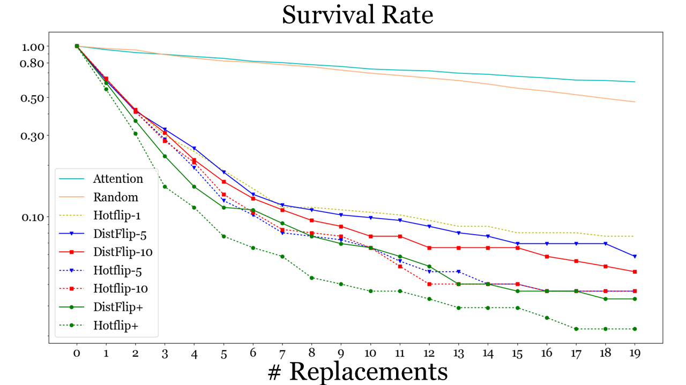
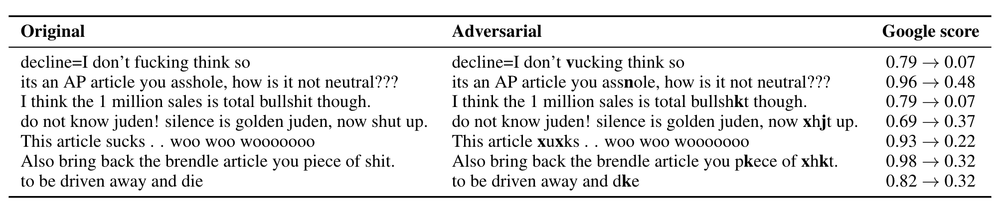

# white2black

## INTRODUCTION
The official code to reproduce results in the NACCL2019 paper:
*White-to-Black: Efficient Distillation of Black-Box Adversarial Attacks*

The code is divided into sub-packages:
##### 1. Agents - _adversarial learned attck generators_
##### 2. Attacks - _optimization attacks like hot flip_
##### 3. Toxic Classifier - _a classifier of sentences toxic/non toxic_
##### 4. Data - _data handling_
##### 5. Resources - _resources for other categories_

## ALGORITHM
As seen in the figure below we train a classifier to predict the class of toxic and non-toxic sentences.
We attack this model using a white-box algorithm called hot-flip and distill the knowledge into a second model.
The second model which we call dist-flip is abel to generate attacks in a black-box manner.
These attacks generalize well to the [Google Perspective](https://www.perspectiveapi.com/) algorithm (tested Jan 2019).

## DATA
We used the data from this [kaggle challenge](https://www.kaggle.com/c/jigsaw-toxic-comment-classification-challenge) 
by Jigsaw

For data flip using HotFlip+ you can download:
https://drive.google.com/file/d/15zSclVYjFYtM1YXUxZbFUpmWS1MgHTx3/view?usp=sharing
and unzip it in toxic_fool\resources\data

## RESULTS
The number of flips needed to change the label of a sentences using the original white box algorithm and ours (green)

Some example sentences:

